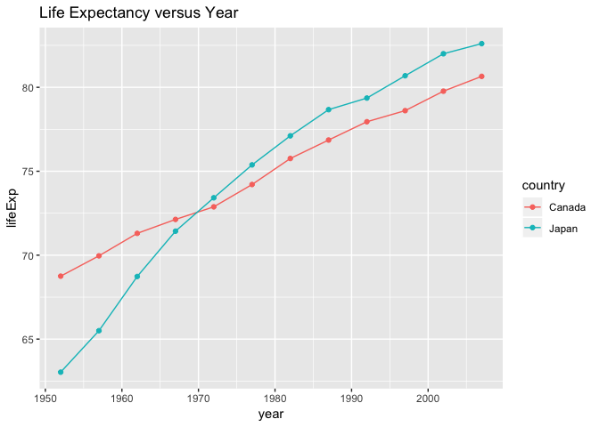

hw-04.Rmd
================
Gurjot Singh
09/10/2018

# Task 1 (Data Reshaping Prompts (and relationship to aggregation))

## Activity \#2: Data Reshaping Prompts (and relationship to aggregation)

**Assignment: Make a tibble with one row per year and columns for life
expectancy for two or more countries.**

**- Use knitr::kable() to make this table look pretty in your rendered
homework.**

**- Take advantage of this new data shape to scatterplot life expectancy
for one country against that of another.**

First, lets go ahead and load the packages we will use in this
assignment.

``` r
library(gapminder)
library(tidyverse)
```

    ## ── Attaching packages ────────────────────────────────────── tidyverse 1.2.1 ──

    ## ✔ ggplot2 3.0.0     ✔ purrr   0.2.5
    ## ✔ tibble  1.4.2     ✔ dplyr   0.7.6
    ## ✔ tidyr   0.8.1     ✔ stringr 1.3.1
    ## ✔ readr   1.1.1     ✔ forcats 0.3.0

    ## ── Conflicts ───────────────────────────────────────── tidyverse_conflicts() ──
    ## ✖ dplyr::filter() masks stats::filter()
    ## ✖ dplyr::lag()    masks stats::lag()

``` r
library(knitr)
library(kableExtra)
```

Now let’s create a new variable, `gapminder_filter` which would filter
out the data by year, life expectancies, and by the countries, Canada
and
Japan.

``` r
gapminder_filter <- gapminder %>% filter((country) %in% c("Canada", "Japan")) %>% select(country, year, lifeExp)
```

We could use the kable function to make the table more aesthetically
appleasing.

``` r
kable(gapminder_filter[1:24, 1:3], caption = "Countries") %>%
  kable_styling("striped", full_width = F) %>%
  group_rows("Canada", 1, 12) %>%
  group_rows("Japan", 13, 24)
```

<table class="table table-striped" style="width: auto !important; margin-left: auto; margin-right: auto;">

<caption>

Countries

</caption>

<thead>

<tr>

<th style="text-align:left;">

country

</th>

<th style="text-align:right;">

year

</th>

<th style="text-align:right;">

lifeExp

</th>

</tr>

</thead>

<tbody>

<tr grouplength="12">

<td colspan="3" style="border-bottom: 1px solid;">

<strong>Canada</strong>

</td>

</tr>

<tr>

<td style="text-align:left; padding-left: 2em;" indentlevel="1">

Canada

</td>

<td style="text-align:right;">

1952

</td>

<td style="text-align:right;">

68.750

</td>

</tr>

<tr>

<td style="text-align:left; padding-left: 2em;" indentlevel="1">

Canada

</td>

<td style="text-align:right;">

1957

</td>

<td style="text-align:right;">

69.960

</td>

</tr>

<tr>

<td style="text-align:left; padding-left: 2em;" indentlevel="1">

Canada

</td>

<td style="text-align:right;">

1962

</td>

<td style="text-align:right;">

71.300

</td>

</tr>

<tr>

<td style="text-align:left; padding-left: 2em;" indentlevel="1">

Canada

</td>

<td style="text-align:right;">

1967

</td>

<td style="text-align:right;">

72.130

</td>

</tr>

<tr>

<td style="text-align:left; padding-left: 2em;" indentlevel="1">

Canada

</td>

<td style="text-align:right;">

1972

</td>

<td style="text-align:right;">

72.880

</td>

</tr>

<tr>

<td style="text-align:left; padding-left: 2em;" indentlevel="1">

Canada

</td>

<td style="text-align:right;">

1977

</td>

<td style="text-align:right;">

74.210

</td>

</tr>

<tr>

<td style="text-align:left; padding-left: 2em;" indentlevel="1">

Canada

</td>

<td style="text-align:right;">

1982

</td>

<td style="text-align:right;">

75.760

</td>

</tr>

<tr>

<td style="text-align:left; padding-left: 2em;" indentlevel="1">

Canada

</td>

<td style="text-align:right;">

1987

</td>

<td style="text-align:right;">

76.860

</td>

</tr>

<tr>

<td style="text-align:left; padding-left: 2em;" indentlevel="1">

Canada

</td>

<td style="text-align:right;">

1992

</td>

<td style="text-align:right;">

77.950

</td>

</tr>

<tr>

<td style="text-align:left; padding-left: 2em;" indentlevel="1">

Canada

</td>

<td style="text-align:right;">

1997

</td>

<td style="text-align:right;">

78.610

</td>

</tr>

<tr>

<td style="text-align:left; padding-left: 2em;" indentlevel="1">

Canada

</td>

<td style="text-align:right;">

2002

</td>

<td style="text-align:right;">

79.770

</td>

</tr>

<tr>

<td style="text-align:left; padding-left: 2em;" indentlevel="1">

Canada

</td>

<td style="text-align:right;">

2007

</td>

<td style="text-align:right;">

80.653

</td>

</tr>

<tr grouplength="12">

<td colspan="3" style="border-bottom: 1px solid;">

<strong>Japan</strong>

</td>

</tr>

<tr>

<td style="text-align:left; padding-left: 2em;" indentlevel="1">

Japan

</td>

<td style="text-align:right;">

1952

</td>

<td style="text-align:right;">

63.030

</td>

</tr>

<tr>

<td style="text-align:left; padding-left: 2em;" indentlevel="1">

Japan

</td>

<td style="text-align:right;">

1957

</td>

<td style="text-align:right;">

65.500

</td>

</tr>

<tr>

<td style="text-align:left; padding-left: 2em;" indentlevel="1">

Japan

</td>

<td style="text-align:right;">

1962

</td>

<td style="text-align:right;">

68.730

</td>

</tr>

<tr>

<td style="text-align:left; padding-left: 2em;" indentlevel="1">

Japan

</td>

<td style="text-align:right;">

1967

</td>

<td style="text-align:right;">

71.430

</td>

</tr>

<tr>

<td style="text-align:left; padding-left: 2em;" indentlevel="1">

Japan

</td>

<td style="text-align:right;">

1972

</td>

<td style="text-align:right;">

73.420

</td>

</tr>

<tr>

<td style="text-align:left; padding-left: 2em;" indentlevel="1">

Japan

</td>

<td style="text-align:right;">

1977

</td>

<td style="text-align:right;">

75.380

</td>

</tr>

<tr>

<td style="text-align:left; padding-left: 2em;" indentlevel="1">

Japan

</td>

<td style="text-align:right;">

1982

</td>

<td style="text-align:right;">

77.110

</td>

</tr>

<tr>

<td style="text-align:left; padding-left: 2em;" indentlevel="1">

Japan

</td>

<td style="text-align:right;">

1987

</td>

<td style="text-align:right;">

78.670

</td>

</tr>

<tr>

<td style="text-align:left; padding-left: 2em;" indentlevel="1">

Japan

</td>

<td style="text-align:right;">

1992

</td>

<td style="text-align:right;">

79.360

</td>

</tr>

<tr>

<td style="text-align:left; padding-left: 2em;" indentlevel="1">

Japan

</td>

<td style="text-align:right;">

1997

</td>

<td style="text-align:right;">

80.690

</td>

</tr>

<tr>

<td style="text-align:left; padding-left: 2em;" indentlevel="1">

Japan

</td>

<td style="text-align:right;">

2002

</td>

<td style="text-align:right;">

82.000

</td>

</tr>

<tr>

<td style="text-align:left; padding-left: 2em;" indentlevel="1">

Japan

</td>

<td style="text-align:right;">

2007

</td>

<td style="text-align:right;">

82.603

</td>

</tr>

</tbody>

</table>

Although we used the `kable` function, the graph could be organized in a
better way. We can reshape the data by making the country a part of the
column section.

``` r
gapminder_reshape <- gapminder_filter %>% spread(country,lifeExp)

kable(gapminder_reshape) %>%
  kable_styling("striped", full_width = F)
```

<table class="table table-striped" style="width: auto !important; margin-left: auto; margin-right: auto;">

<thead>

<tr>

<th style="text-align:right;">

year

</th>

<th style="text-align:right;">

Canada

</th>

<th style="text-align:right;">

Japan

</th>

</tr>

</thead>

<tbody>

<tr>

<td style="text-align:right;">

1952

</td>

<td style="text-align:right;">

68.750

</td>

<td style="text-align:right;">

63.030

</td>

</tr>

<tr>

<td style="text-align:right;">

1957

</td>

<td style="text-align:right;">

69.960

</td>

<td style="text-align:right;">

65.500

</td>

</tr>

<tr>

<td style="text-align:right;">

1962

</td>

<td style="text-align:right;">

71.300

</td>

<td style="text-align:right;">

68.730

</td>

</tr>

<tr>

<td style="text-align:right;">

1967

</td>

<td style="text-align:right;">

72.130

</td>

<td style="text-align:right;">

71.430

</td>

</tr>

<tr>

<td style="text-align:right;">

1972

</td>

<td style="text-align:right;">

72.880

</td>

<td style="text-align:right;">

73.420

</td>

</tr>

<tr>

<td style="text-align:right;">

1977

</td>

<td style="text-align:right;">

74.210

</td>

<td style="text-align:right;">

75.380

</td>

</tr>

<tr>

<td style="text-align:right;">

1982

</td>

<td style="text-align:right;">

75.760

</td>

<td style="text-align:right;">

77.110

</td>

</tr>

<tr>

<td style="text-align:right;">

1987

</td>

<td style="text-align:right;">

76.860

</td>

<td style="text-align:right;">

78.670

</td>

</tr>

<tr>

<td style="text-align:right;">

1992

</td>

<td style="text-align:right;">

77.950

</td>

<td style="text-align:right;">

79.360

</td>

</tr>

<tr>

<td style="text-align:right;">

1997

</td>

<td style="text-align:right;">

78.610

</td>

<td style="text-align:right;">

80.690

</td>

</tr>

<tr>

<td style="text-align:right;">

2002

</td>

<td style="text-align:right;">

79.770

</td>

<td style="text-align:right;">

82.000

</td>

</tr>

<tr>

<td style="text-align:right;">

2007

</td>

<td style="text-align:right;">

80.653

</td>

<td style="text-align:right;">

82.603

</td>

</tr>

</tbody>

</table>

Now the list isn’t as long as the previous list (`gapminder_filter`).

We could also use ggplot to plot our function.

``` r
ggplot(gapminder_filter, aes(year,lifeExp)) +
  geom_line(aes(colour=country)) +
  geom_point(aes(colour=country)) +
  ggtitle("Life Expectancy versus Year")
```

<!-- -->

It’s interesting to note that at the year 1970, there is a point of
intersection where Japan’s life expectancy becomes higher than Canada’s
life expectancy.

# Join Prompts (join, merge, look up)

## Activity \#2

**Assignment: Create your own cheatsheet patterned after Jenny’s but
focused on something you care about more than comics\! Inspirational
examples:**

**- Pets I have owned + breed + friendly vs. unfriendly + ??. Join to a
table of pet breed, including variables for furry vs not furry, mammal
true or false, etc.**

**- Movies and studios…**

**- Athletes and teams…**

First, lets create a dataset of different movies. The following varibles
will also be recorded: parental advisory, genre, and classification.

``` r
movies <- "
Name, Parental Advisory,  Genre,  Classification
Shutter Island, Rated R,  Thriller, Fiction
The Pursuit of Happiness, Rated PG-13,  Drama,  Non-fiction
Titanic,  Rated PG-13,  Romance, Non-fiction
Gone Girl,  Rated R,  Thriller, Fiction
Disturbia,  Rated PG-13,  Thriller, Fiction
Game Night, Rated PG-13,  Comedy, Fiction
"
movies <- read_csv(movies, skip = 1)
```

Lets create another dataset which has genre (which is the same column
from the above dataset `movies` and could be used to merge the two
datasets together) and by a categorical variable which tells us if it is
my favourtie genre or not.

``` r
genre_preference <- "
Genre,  Favourite Genre
Thriller, Yes
Romance,  No
Drama,  Yes
"
genre_preference <- read_csv(genre_preference, skip = 1)
```

Since we have our two datasets (`movies` and `genre_preference`), we
could merge them together by using many functions such as:

  - `inner_join(x, y)`
  - `semi_join(x, y)`
  - `left_join(x, y)`
  - `anti_join(x, y)`

For ease of understanding I have included the definitions of each
function in this assignment:

**inner\_join(x, y): Return all rows from x where there are matching
values in y, and all columns from x and y. If there are multiple matches
between x and y, all combination of the matches are returned. This is a
mutating join**

``` r
ijmg <- inner_join(movies, genre_preference)
```

    ## Joining, by = "Genre"

``` r
kable(ijmg) %>%
  kable_styling("striped", full_width = F)
```

<table class="table table-striped" style="width: auto !important; margin-left: auto; margin-right: auto;">

<thead>

<tr>

<th style="text-align:left;">

Name

</th>

<th style="text-align:left;">

Parental Advisory

</th>

<th style="text-align:left;">

Genre

</th>

<th style="text-align:left;">

Classification

</th>

<th style="text-align:left;">

Favourite Genre

</th>

</tr>

</thead>

<tbody>

<tr>

<td style="text-align:left;">

Shutter Island

</td>

<td style="text-align:left;">

Rated R

</td>

<td style="text-align:left;">

Thriller

</td>

<td style="text-align:left;">

Fiction

</td>

<td style="text-align:left;">

Yes

</td>

</tr>

<tr>

<td style="text-align:left;">

The Pursuit of Happiness

</td>

<td style="text-align:left;">

Rated PG-13

</td>

<td style="text-align:left;">

Drama

</td>

<td style="text-align:left;">

Non-fiction

</td>

<td style="text-align:left;">

Yes

</td>

</tr>

<tr>

<td style="text-align:left;">

Titanic

</td>

<td style="text-align:left;">

Rated PG-13

</td>

<td style="text-align:left;">

Romance

</td>

<td style="text-align:left;">

Non-fiction

</td>

<td style="text-align:left;">

No

</td>

</tr>

<tr>

<td style="text-align:left;">

Gone Girl

</td>

<td style="text-align:left;">

Rated R

</td>

<td style="text-align:left;">

Thriller

</td>

<td style="text-align:left;">

Fiction

</td>

<td style="text-align:left;">

Yes

</td>

</tr>

<tr>

<td style="text-align:left;">

Disturbia

</td>

<td style="text-align:left;">

Rated PG-13

</td>

<td style="text-align:left;">

Thriller

</td>

<td style="text-align:left;">

Fiction

</td>

<td style="text-align:left;">

Yes

</td>

</tr>

</tbody>

</table>

It is interesting to note that the movies Game Night is not shown in the
merged data as it does not have a corresponding genre with the
`genre_preference` dataset.

**semi\_join(x, y): Return all rows from x where there are matching
values in y, keeping just columns from x. A semi join differs from an
inner join because an inner join will return one row of x for each
matching row of y, where a semi join will never duplicate rows of x.
This is a filtering join**

``` r
sjmg <- semi_join(movies, genre_preference)
```

    ## Joining, by = "Genre"

``` r
kable(sjmg) %>%
  kable_styling("striped", full_width = F)
```

<table class="table table-striped" style="width: auto !important; margin-left: auto; margin-right: auto;">

<thead>

<tr>

<th style="text-align:left;">

Name

</th>

<th style="text-align:left;">

Parental Advisory

</th>

<th style="text-align:left;">

Genre

</th>

<th style="text-align:left;">

Classification

</th>

</tr>

</thead>

<tbody>

<tr>

<td style="text-align:left;">

Shutter Island

</td>

<td style="text-align:left;">

Rated R

</td>

<td style="text-align:left;">

Thriller

</td>

<td style="text-align:left;">

Fiction

</td>

</tr>

<tr>

<td style="text-align:left;">

The Pursuit of Happiness

</td>

<td style="text-align:left;">

Rated PG-13

</td>

<td style="text-align:left;">

Drama

</td>

<td style="text-align:left;">

Non-fiction

</td>

</tr>

<tr>

<td style="text-align:left;">

Titanic

</td>

<td style="text-align:left;">

Rated PG-13

</td>

<td style="text-align:left;">

Romance

</td>

<td style="text-align:left;">

Non-fiction

</td>

</tr>

<tr>

<td style="text-align:left;">

Gone Girl

</td>

<td style="text-align:left;">

Rated R

</td>

<td style="text-align:left;">

Thriller

</td>

<td style="text-align:left;">

Fiction

</td>

</tr>

<tr>

<td style="text-align:left;">

Disturbia

</td>

<td style="text-align:left;">

Rated PG-13

</td>

<td style="text-align:left;">

Thriller

</td>

<td style="text-align:left;">

Fiction

</td>

</tr>

</tbody>

</table>

Using the `semi-join` function we only get variables that are shown in
the `movies` dataset.

**left\_join(x, y): Return all rows from x, and all columns from x and
y. If there are multiple matches between x and y, all combination of the
matches are returned. This is a mutating join**

``` r
ljmg <- left_join(movies, genre_preference)
```

    ## Joining, by = "Genre"

``` r
kable(ljmg) %>%
  kable_styling("striped", full_width = F)
```

<table class="table table-striped" style="width: auto !important; margin-left: auto; margin-right: auto;">

<thead>

<tr>

<th style="text-align:left;">

Name

</th>

<th style="text-align:left;">

Parental Advisory

</th>

<th style="text-align:left;">

Genre

</th>

<th style="text-align:left;">

Classification

</th>

<th style="text-align:left;">

Favourite Genre

</th>

</tr>

</thead>

<tbody>

<tr>

<td style="text-align:left;">

Shutter Island

</td>

<td style="text-align:left;">

Rated R

</td>

<td style="text-align:left;">

Thriller

</td>

<td style="text-align:left;">

Fiction

</td>

<td style="text-align:left;">

Yes

</td>

</tr>

<tr>

<td style="text-align:left;">

The Pursuit of Happiness

</td>

<td style="text-align:left;">

Rated PG-13

</td>

<td style="text-align:left;">

Drama

</td>

<td style="text-align:left;">

Non-fiction

</td>

<td style="text-align:left;">

Yes

</td>

</tr>

<tr>

<td style="text-align:left;">

Titanic

</td>

<td style="text-align:left;">

Rated PG-13

</td>

<td style="text-align:left;">

Romance

</td>

<td style="text-align:left;">

Non-fiction

</td>

<td style="text-align:left;">

No

</td>

</tr>

<tr>

<td style="text-align:left;">

Gone Girl

</td>

<td style="text-align:left;">

Rated R

</td>

<td style="text-align:left;">

Thriller

</td>

<td style="text-align:left;">

Fiction

</td>

<td style="text-align:left;">

Yes

</td>

</tr>

<tr>

<td style="text-align:left;">

Disturbia

</td>

<td style="text-align:left;">

Rated PG-13

</td>

<td style="text-align:left;">

Thriller

</td>

<td style="text-align:left;">

Fiction

</td>

<td style="text-align:left;">

Yes

</td>

</tr>

<tr>

<td style="text-align:left;">

Game Night

</td>

<td style="text-align:left;">

Rated PG-13

</td>

<td style="text-align:left;">

Comedy

</td>

<td style="text-align:left;">

Fiction

</td>

<td style="text-align:left;">

NA

</td>

</tr>

</tbody>

</table>

The `left_join` function is really great because you get both the
`movies` dataset and the `genre_preference` dataset back including the
previously ommited Game Night movie which now just has a “NA” under
Favourite Genre.

**anti\_join(x, y): Return all rows from x where there are not matching
values in y, keeping just columns from x. This is a filtering join**

``` r
ajmg <- anti_join(movies, genre_preference)
```

    ## Joining, by = "Genre"

``` r
kable(ajmg) %>%
  kable_styling("striped", full_width = F)
```

<table class="table table-striped" style="width: auto !important; margin-left: auto; margin-right: auto;">

<thead>

<tr>

<th style="text-align:left;">

Name

</th>

<th style="text-align:left;">

Parental Advisory

</th>

<th style="text-align:left;">

Genre

</th>

<th style="text-align:left;">

Classification

</th>

</tr>

</thead>

<tbody>

<tr>

<td style="text-align:left;">

Game Night

</td>

<td style="text-align:left;">

Rated PG-13

</td>

<td style="text-align:left;">

Comedy

</td>

<td style="text-align:left;">

Fiction

</td>

</tr>

</tbody>

</table>

The `anti_join` function shows the rows from which the previous dataset
of `movies` does not have a corresponding set in the `genre_preference`
dataset.

# I hope you enjoyed my page\!
